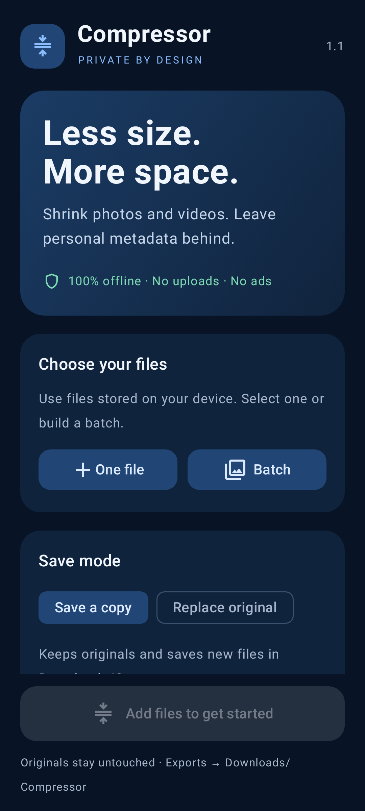

# Compressor

**Compressor 1.1** is a free Android app that compresses photos and videos and removes personal metadata. Everything runs on your device, with a modern dark blue interface.

**Android 10 or newer · Completely offline · No ads · No payments · No account**

[**Download Compressor 1.1**](https://github.com/pavelcerny1110-png/Compressor-Release/releases/tag/v1.1.0) · [Report a bug or request a feature](https://github.com/pavelcerny1110-png/Compressor-Release/issues)

## Features

- Compress one photo or video, or process a batch with the same settings.
- Choose **Small**, **Balanced**, or **High quality** presets.
- Set an optional maximum size in MB for each output file.
- Export photos as **JPEG**, **WebP**, or **PNG**, with an **Auto** option.
- Export videos as **MP4**, using **H.264** or **HEVC / H.265** when your phone supports it.
- Remove personal metadata during compression, including embedded location, camera and author details, and original capture dates.
- Choose **Save a copy** or **Replace original**.
- View progress, cancel processing, retry failed items, and share completed files.

## App preview

Interface rendered with an Android phone profile. Layout can vary with screen size and font settings.

## Install

1. Open the [Compressor 1.1 release](https://github.com/pavelcerny1110-png/Compressor-Release/releases/tag/v1.1.0) and download **Compressor-1.1.apk**.
2. Open the APK on your Android device.
3. If Android asks, allow installation from the browser or file manager you used, then tap **Install**.

Public releases use a permanent signing key so future updates can install over this version. If Android reports a signing conflict with an earlier build, finish any pending original-file recovery before uninstalling it, then install this release. Uninstalling clears the app's private queue, settings, and recovery backups; saved copies in Downloads remain.

## How to use

1. Tap **One file** or **Batch** and select media stored on your device.
2. Choose a preset, photo output format, and video codec. Optionally enter a size limit.
3. Choose a save mode:
   - **Save a copy** is the default. New files go to **Downloads/Compressor**, which the app creates automatically. Originals stay unchanged.
   - **Replace original** keeps the original file name and location and asks for confirmation before overwriting.
4. Tap **Compress** or **Replace**. Follow progress and results in the queue.

The size limit applies to **each file**, using **1 MB = 1,000,000 bytes**. If the app cannot meet the limit, that file reports an error. Smaller outputs can mean lower visual quality. Already compressed media may produce no size saving.

## Supported formats

| Media | Common inputs | Output |
| --- | --- | --- |
| Photos | JPEG, PNG, WebP, HEIC/HEIF, BMP, still GIF, and supported AVIF | JPEG, WebP, PNG |
| Videos | MP4, MOV, MKV, WebM, 3GP, when the device can decode their tracks | MP4 with H.264 or HEVC |

Input support depends on the Android version and your phone's decoders. HEVC requires a compatible encoder. Animated GIF and WebP images are unsupported. Transparency is preserved by PNG and WebP; JPEG uses a white background. Images and videos are never upscaled. HDR video is converted to SDR.

## Replacing originals

Replacement supports **writable JPEG, PNG, WebP, and MP4/M4V files**. Photos keep their original format. Other formats can be converted with **Save a copy**. Read-only files and providers cannot be replaced; you may need to select a file again to grant editing access.

The app finishes compression before writing to the original. It keeps a private recovery backup while replacing the file, checks the written result, and attempts to restore the original if writing fails or is cancelled. Successful replacement removes the backup and cannot be undone through the app.

If interrupted writing leaves recovery pending, keep the app installed and its data intact. Use **Retry recovery**, or **Save recovery copy** if the original location is unavailable. Recovery requires extra device storage and temporarily retains the original metadata in the private backup. Keep your own backups of files you value.

## Privacy

Compressor has no internet permission, uploads, analytics, or advertising. It works on files you select through Android's file picker; it does not request access to your entire storage. Notification permission is optional and supports background progress updates.

Personal metadata is stripped from successful outputs. Information needed for playback, such as orientation, dimensions, codecs, and media timing, remains. Visible information inside a photo or video is unchanged. Replacement retains the original file name and provider-managed file dates; copy mode leaves the original file and its metadata untouched.

## Bugs and feature requests

Use [GitHub Issues](https://github.com/pavelcerny1110-png/Compressor-Release/issues) to report problems or suggest improvements. For a bug, include your Android version, phone model, app version, input format, chosen settings, and any error message. Avoid attaching private photos, videos, or personal metadata.
